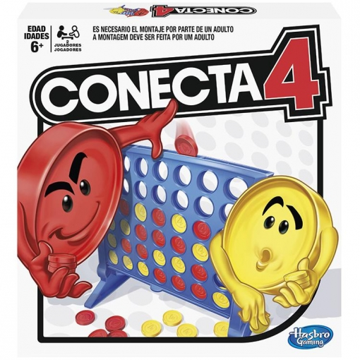

# Connect4
Universo Santa Tecla  
[uSantaTecla@gmail.com](mailto:uSantaTecla@gmail.com)  
s
## index

* [domainModel](#domainModel)  
    * [vocabulary](#vocabulary)  
    * [initialState](#initialState)  
    * [finalState](#finalState)
    * [instructions](#instructions)  
## domainModel  
  
 

#### Vocabulary

1. Yellow y Red es un valor de Disk no tiene un comportamiento distinto por ser amarillo o rojo, usar un enumerado para resaltarlo.
2. La relación de composición entre Disk y Goal es incorrecta porque indicas que un disco esta unido de forma privada, duradera e inherente a un objetivo, lo correcto es una relacion de uso ya que que un objetivo utiliza un disco para cumplir una labor.

#### InitialState

Nada que destacar.

#### FinalState

1. Incoherencia respecto al diagrama de clases, el turn no es compuesto de connect4, quien es compuesto de connect4 es player.
2. Player esta asociado a turno.
3. Parece más un diagrama de clases que de estados, no representa el estado final de una partida solo se indica las relaciones de los objetos.

[WIKI](https://es.wikipedia.org/wiki/Solitario_de_cartas)

[Youtube](https://www.youtube.com/watch?v=yjgQXcFVBQY)

  
