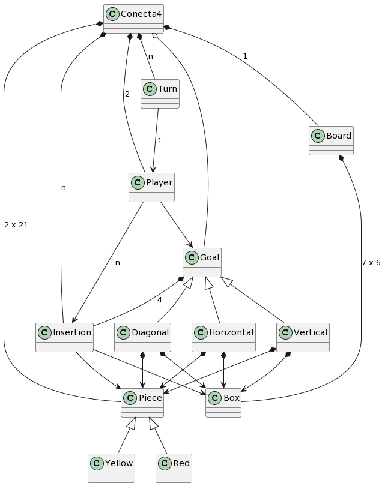
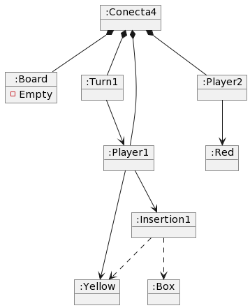
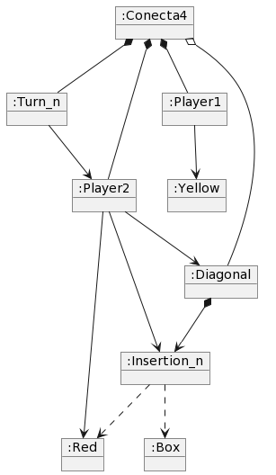

# Connect4
Universo Santa Tecla  
[uSantaTecla@gmail.com](mailto:uSantaTecla@gmail.com)  

## index

   * [vocabulary](#vocabulary)  
   * [initialstate](#initialstate)  
   * [finalstate](#finalstate)

### vocabulary

  

- Cuando la cardinalidad es 1 no hace falta ponerlo o si se pone se ha de poner siempre.
- La cardinalidad en algunos casos no se sabe de que lado está.
- Falta relación entre **Player** y **Piece** para reflejar que cada jugador juega con sus 21 fichas.
- No diría que Conecta4 tiene N objetos **Turn** si no un objeto **Turn** que cambia de estado según el **Player** al que le toca insertar. 
- Sacaría una relación de **Goal** a **Box** y a **Piece** en vez de hacerlo de cada subclase.
- Diría que la relación entre **Player** y **Insertion** es de uso y no de asociación porque es efímera, el jugador hace una inserción en algún momento y se olvida de ella si no lleva la cuenta de las inserciones hechas
- Como un objeto de la clase **Goal** ya se relaciona con cuatro objetos **Insertion**, que a su vez se relacionan cada uno con una **Piece** y una **Box**, la relación entre los **Goal** con **Piece** y **Box** me resulta redundante. 
- No diría que un **conecta4** tiene un agregado de **Goal** / objetivos, si no que tiene un objetivo o mejor aún que cada jugador tiene un agregado de objetivos (el objetivo es el objetivo de los jugadores, y en cualquier momento de la partida cada jugador tiene alguna clase de objetivo en mente)
- Echo de menos la información de que un jugador no puede insertar su ficha en cualquier casilla del tablero, tiene que hacerlo en una columna que no esté llena.
- Falta indicar que algunas clases como **Goal** o **Piece** son abstractas

### initialstate  
  
  

- ¿Si Empty es el nombre de la propiedad, qué valor tiene? ¿Sí es un valor, de qué propiedad?
- No existe relación entre clases **Player** y **Red** o **Yellow** en el diagrama de clases, no puede aparecer aquí entre sus objetos. 
- Player1, Player2, Insertion1, Turn1 escritos a la derecha de ":" no son clases del diagrama de clases (podrían ser nombres de objetos a la izquierda del ":").
- La relación entre objetos de las clases **Insertion** y **Box** no puede ser de uso si en el diagrama de clases es de asociación.
- El diagrama se llama Initial State (de comienzo de la partida) pero ya aparece un objeto insertion.
- En el diagrama de clases un **Board** tiene 7x6 **Box**/casillas, pero aquí no aparecen sus casillas (aparece un objeto casilla pero no tiene ninguna relación con el board)
- Si existiese la relación entre **Player** y ficha en el diagrama de clases, un **Player** tiene 21 fichas no una ficha.
  
### finalstate 

  

- En el diagrama de clases un objeto de uno de los tipos de **Goal** se relaciona con 4 objetos de la clase **Insertion** pero aquí solo aparece un objeto **Insertion**.
- La relación del **Player** con **Insertion** es de asociación según el diagrama de clases y no es de uso..  dónde están entonces los objetos **Insertion** de esa relación duradera con los **Player**?.
  

  
 
