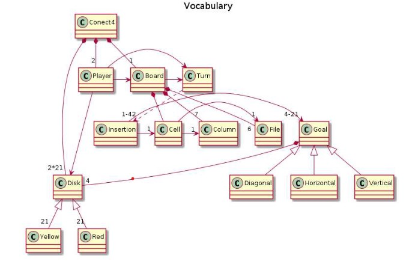

# Connect4
Universo Santa Tecla  
[uSantaTecla@gmail.com](mailto:uSantaTecla@gmail.com)  

## index

* [domainModel](#domainModel)  
    * [vocabulary](#vocabulary)  
    * [initialState](#initialState)  
    * [finalState](#finalState)
    * [instructions](#instructions)  

## domainModel  

  

[WIKI](https://es.wikipedia.org/wiki/Conecta_4)

[Youtube](https://www.youtube.com/watch?v=JBSbiilzg9U)

### Crítica  
###  lab-lovalace 

### vocabulary

  

Turno aparece de la nada, debe ser una parte de Conecta4 
  - Turno debería estar asociado al Jugador activo.
  - Insertion aparece de la nada, podría ser parte del Conecta4
  - Unificación en el vocabulario Insertion/Movement 
  - Player podría estar asociado a Insertion

### initialState   

  

- En el modelo Player estaba asociado a Disk, no estaba compuesto de Disk
- 

### finalState 

- No se está definiendo un estado final
- El turno tendría 1 sólo jugador
- Goal es una clase, no debería aparece en un diagrama de objetos
- Si debería aparecer un objeto horizontal (de la clase Horizontal que es un tipo de Goal)
  
### instructions  
  
  
  
  
  
 
