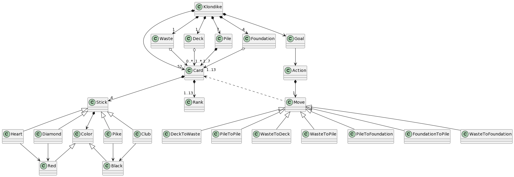
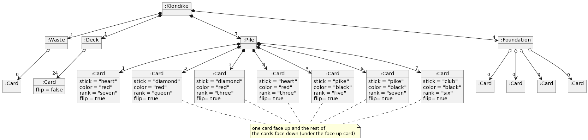
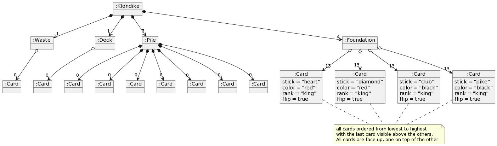

# Klondike
Universo Santa Tecla  
[uSantaTecla@gmail.com](mailto:uSantaTecla@gmail.com)  

## index
   * [domainModel](#domainModel) 
   * [vocabulary](#vocabulary)  
   * [initialstate](#initialstate)  
   * [finalstate](#finalstate) 
   
### domainModel  
  
  

### vocabulary

 

- Falta clase **Player**
- Un **Foundation** tiene un agregado de 1..13 cartas pero al inicio de la partida tiene 0 cartas.
- Un **Deck** tiene un agregado de 1..* cartas. ¿No podría tener 0 cartas cuando están todas las del **Deck** en el **Waste**?.
- Un **Pile** tiene 1..7 cartas. ¿No podría tener 0 cartas cuando muevo todas las cartas de un **Pile** a otro? ¿y por qué máximo tiene 7 cartas?
- Por qué la relación entre clases **Deck**, **Waste**, **Foundation** con **Card** es de agregación y entre **Pile** y **Card** es de composición?
- No diría que la relación entre clases **Deck**, **Waste**, **Foundation** y **Pile** con **Card** es de composición si no de asociación porque las cartas se van moviendo de un sitio a otro durante la partida, la relación es compartida/pública.
- Quitaría la clase acción porque ya está la de movimiento (la relación sería directamente de **Goal** a **Move**).
- Diría que la relación entre Goal y Move es de uso (el objetivo se alcanza usando los movimientos).
- Llamaría a la clase "Goal" de otra forma (AllCardsToFoundationsGoal) para reflejar cuál es el objetivo.
- Entre las clases de movimiento hay cosas en común, WasteToFoundation y PileToFoundation podrían heredar de clase base From*ToFoundation por ejemplo.

  
### initialState  
  
  

- Cuando un objeto **Waste** tiene 0 objetos **Card** el objeto **Card** no debería aparecer.
- Si **Deck** tiene 24 cartas se debería dibujar 24 relaciones, una con cada uno de los 24 objetos Card, no una relación entre dos objetos de cardinalidad 24. Para no pintar los 24 objetos **Card** y sus relaciones con **Deck** se hace de otra manera. Lo mismo para el resto de relaciones del diagrama (Klondike con Pile, Pile con Card etc)
- Relacionado con lo anterior, un objeto Pile no puede tener relación con cartas que están todas bocarriba.
- El color es en realidad una propiedad del palo según el diagrama de clases, pero no de la carta.
- La carta del Deck debería tener propiedades stick y ranking y sus valores como las otras, aunque este bocaabajo.
  
### finalState 

  

- Como en el diagrama anterior creo que no se puede pintar que un objeto Klondike tiene una relación de cardinalidad 7 con un objeto Pile para indicar que se relaciona con 7 objetos.
- El Klondike tiene un Goal y el Goal está asociado a acciones que tienen 1 movimiento, ¿Dónde están estos objetos que son palabras clave (Goal, Action, Move) en el diagrama?.

  
