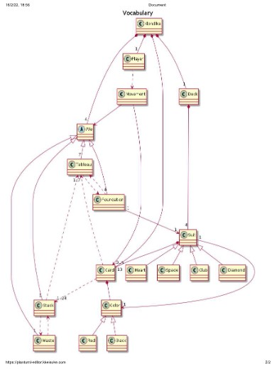
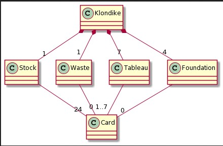
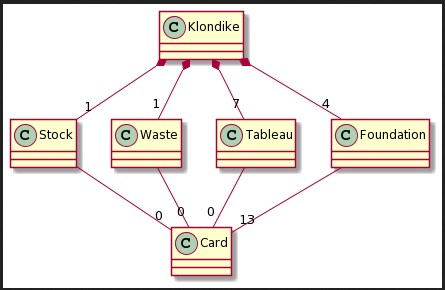

# Connect4
Universo Santa Tecla  
[uSantaTecla@gmail.com](mailto:uSantaTecla@gmail.com)  

## index

* [domainModel](#domainModel)  
    * [vocabulary](#vocabulary)  
    * [initialState](#initialState)  
    * [finalState](#finalState)
    * [instructions](#instructions)  

## domainModel  

  

[WIKI](https://es.wikipedia.org/wiki/Conecta_4)

[Youtube](https://www.youtube.com/watch?v=JBSbiilzg9U)

### Crítica  
###  lab-lovalace 

### vocabulary

  

- Klondike compuesto por 4 Pile que pueden ser de 4 tipos diferentes. Coincido.
- Player usa Movement que ¿podría estar asociado a 2 Piles?, origen y destino de la carta
- Deck es parte de Klondike. Deck está compuesto de 52 Cards.
- Pile está compuesta de 0..n Cards
- Movement asociado a 1..n Cards, no hay movimientos de 0 cartas.
- Si ya tenemos asociación entre Pile y Card, no serían redundantes las asociaciones entre las diferentes Piles?
- Cuál es el objetivo del juego, no aparece. Goal como parte de Klondike asociado a 4 Foundations con 13 cartas cada uno.

### initialState   

  

- Este diagrama representa un estado momentáneo, debería ser un diagrama de objetos, no de clases.
- El cuadro tendría sólo una división, sobra la letra "C" y el nombre de objeto en minúscula.
- Waste comienza con 1 carta 
### finalState 

- Este diagrama representa un estado momentáneo, debería ser un diagrama de objetos, no de clases.
- Los objetos stock, waste y tableau, para mi son relevantes, ya decimos que foundation tiene 4x13 cartas, que es el total.
- No aparece ninguna referencia a que este estado es el objetivo del juego
  
### instructions  
  
  
  
  
  
