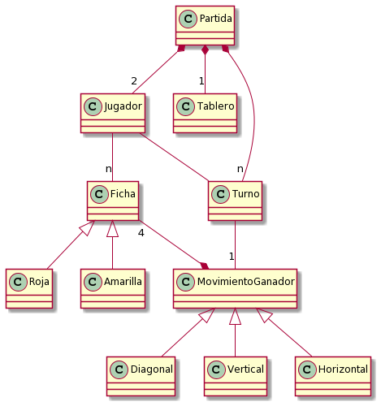
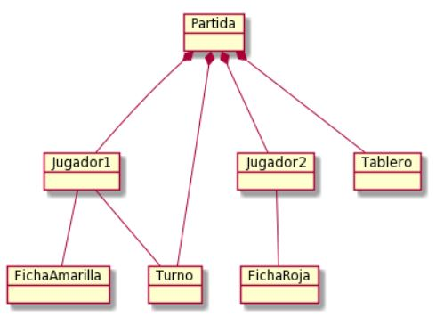
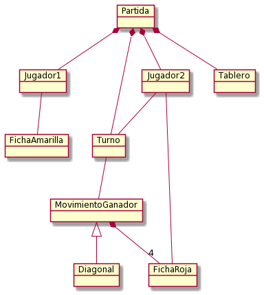
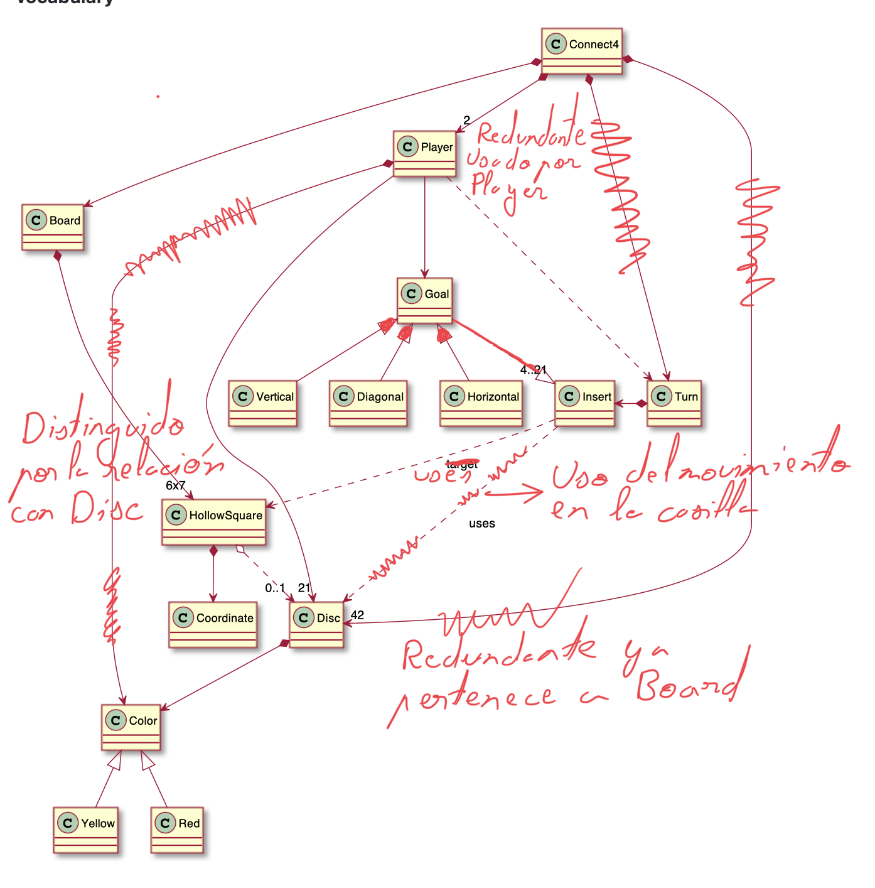
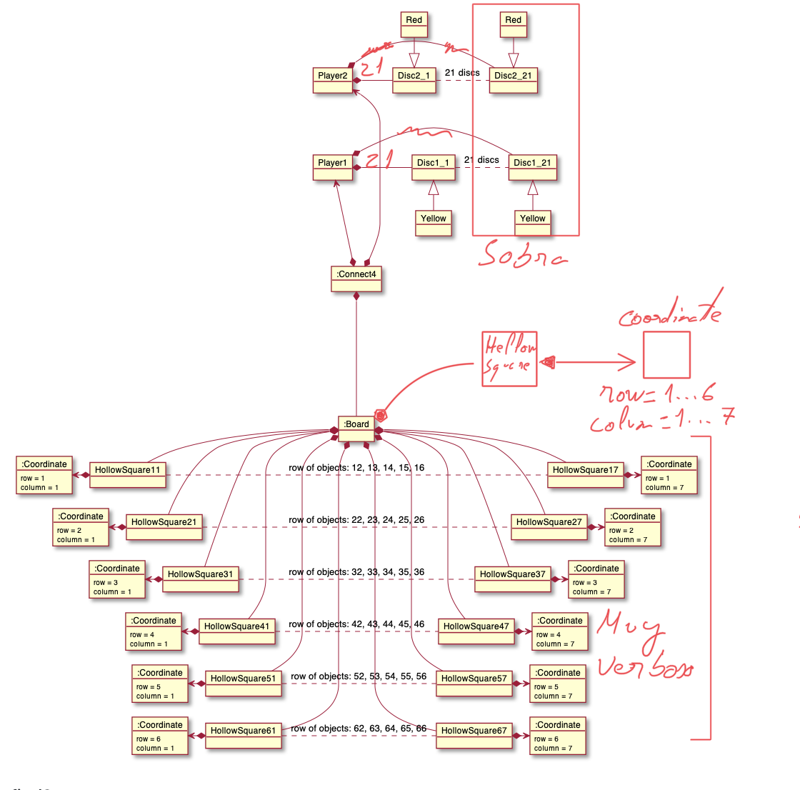
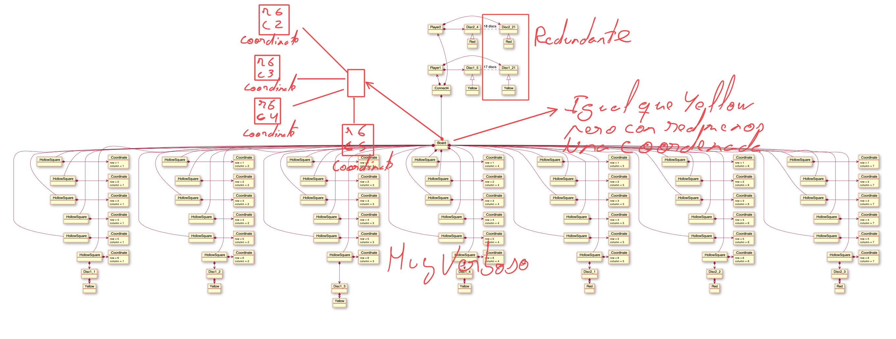

# Connect4
Universo Santa Tecla  
[uSantaTecla@gmail.com](mailto:uSantaTecla@gmail.com)  

## index

## domainModel  

  

[WIKI](https://es.wikipedia.org/wiki/Conecta_4)

[Youtube](https://www.youtube.com/watch?v=JBSbiilzg9U)

 
## Críticas   

###  lab-turing
 * [domainModel](#domainModel)  
   * [vocabulary](#vocabulary)
   
     
     
      1. Según las reglas cada jugador debería tener **como máximo** 21 fichas
      2. De jugador a turno se podría poner una flecha para indicar mejor la asociación, en este caso la dirección sería de turno -> jugador
      3. El turno no debería ser o tener conocimiento directo de los movimientos de las fichas, sería importante hacer el tablero un poco **más inteligente**

      Para mejorarlo se podría crear una modelo "Posición" o "Campo" (las partes en las que se divide el tablero) donde irían a ubicarse las **Fichas**, Luego el movimiento ganador tendría una relación directa con el jugador, puesto que este es el que realizara estos movimientos por medio de **acciones** qué recaen en las fichas al **mover** o **usar**.
 
   * [initialState](#initialState)
   
     
     
      1. No es un diagrama de objetos
      2. ¿Las fichas están en el tablero? Si es así sería incorrecto debido a qué el estado inicial debería tener el tablero vacío
      3. Indicar mejor las asociaciones
      4. Las fichas deberían estar en una **posición** del **tablero**
      5. ¿Es importante mostrar el turno?

   * [finalState](#finalState)
   
     
     
      1. Reitero, el tablero está de decoración (sin ofender)
      2. ¿Cuántas fichas amarillas hay en el tablero?
      3. Vemos que hay 4 fichas rojas haciendo un movimiento ganador ¿Dónde están estas fichas? ¿En la mesa alineadas? jeje
      4. Mejorar la intensión de las asociaciones
  
   * [instructions](#instructions)
   
    No se adjunto instrucciones

### lab-dijkstra 

  * [domainModel](#domainModel)  
    * [vocabulary](#vocabulary)  
      
    * [initialState](#initialState)
          
    * [finalState](#finalState)
          
    * [instructions](#instructions)
      Instrucciones OK.

    
###  lab-lovalace 

  * [domainModel](#domainModel)  
    * [vocabulary](#vocabulary) 
    
      

      ACLARACION: SOY EL CRITICO DE lab-chomsky PERO NO HAN COLGADO SOLUCION ALGUNA. COMO SE TRATA DE APRENDER Y EQUIVOCARNOS, ME HE PUESTO A ANALIZAR LA SOLUCION DEL COMPAÑERO DEL LABORATORIO DE AL LADO. DEJO LA COMPARATICA DE LO QUE, A MI CRITERIO, ES CORREGIBLE.
      
    * [initialState](#initialState)  
    * [finalState](#finalState)
    * [instructions](#instructions)

    
###  lab-chomsky

  * [domainModel](#domainModel)  
    * [vocabulary](#vocabulary)  
    * [initialState](#initialState)  
    * [finalState](#finalState)
    * [instructions](#instructions)
