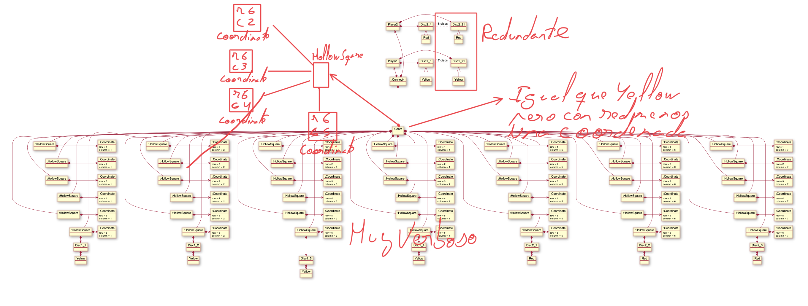

# Connect4
Universo Santa Tecla  
[uSantaTecla@gmail.com](mailto:uSantaTecla@gmail.com)  

## index

## domainModel  

  

[WIKI](https://es.wikipedia.org/wiki/Conecta_4)

[Youtube](https://www.youtube.com/watch?v=JBSbiilzg9U)

 
## Críticas   

###  lab-turing

* [domainModel](#domainModel)  
    * [vocabulary](#vocabulary)
    * [initialState](#initialState)  
    * [finalState](#finalState)
    * [instructions](#instructions)

### lab-dijkstra 

  * [domainModel](#domainModel)  
    * [vocabulary](#vocabulary)  
      
    * [initialState](#initialState)
          
    * [finalState](#finalState)
          
    * [instructions](#instructions)
      Instrucciones OK.

    
###  lab-lovalace 

  * [domainModel](#domainModel)  
    * [vocabulary](#vocabulary)  
    * [initialState](#initialState)  
    * [finalState](#finalState)
    * [instructions](#instructions)

    
###  lab-chomsky

  * [domainModel](#domainModel)  
    * [vocabulary](#vocabulary)  
    * [initialState](#initialState)  
    * [finalState](#finalState)
    * [instructions](#instructions)
